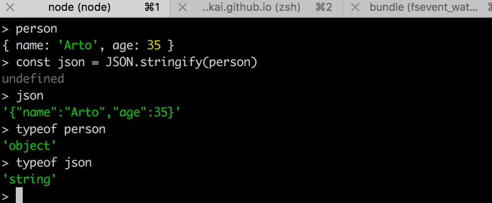

<div class="content">

في هذا الجزء، ينتقل تركيزنا نحو الواجهة الخلفية: أي نحو تنفيذ الوظائف على جانب الخادم من المنظومة.

سنبني واجهتنا الخلفية على أساس [NodeJS](https://nodejs.org/en/)، وهي بيئة تشغيل لـ JavaScript مبنية على محرك [Chrome V8](https://developers.google.com/v8/).

كُتبت مادة هذا المقرر باستخدام الإصدار <i>v22.3.0</i> من Node.js. تأكد من أن إصدار Node لديك حديث على الأقل بقدر الإصدار المستخدم في المادة (يمكنك التحقق من الإصدار بتنفيذ _node -v_ في سطر الأوامر).

كما ذُكر في [الجزء 1](/part1/java_script)، لا تدعم المتصفحات بعد أحدث ميزات JavaScript، ولهذا يجب <i>ترجمة</i> الشيفرة العاملة في المتصفح باستخدام مثل [babel](https://babeljs.io/). الوضع مختلف مع JavaScript العاملة في الواجهة الخلفية. يدعم أحدث إصدار من Node الغالبية العظمى من أحدث ميزات JavaScript، لذا يمكننا استخدام أحدث الميزات دون الحاجة إلى ترجمة شيفرتنا.

هدفنا هو تنفيذ واجهة خلفية تعمل مع تطبيق الملاحظات من [الجزء 2](/part2). لكن لنبدأ بالأساسيات عبر تنفيذ تطبيق "hello world" الكلاسيكي.

**انتبه** إلى أن التطبيقات والتمارين في هذا الجزء ليست كلها تطبيقات React، ولن نستخدم أداة <i>create vite@latest -- --template react</i> لتهيئة المشروع لهذا التطبيق.

سبق أن ذكرنا [npm](/part2/getting_data_from_server#npm) في الجزء 2، وهي أداة تُستخدم لإدارة حزم JavaScript. في الواقع، أصل npm من منظومة Node.

لننتقل إلى مجلد مناسب، وننشئ قالباً جديداً لتطبيقنا باستخدام الأمر _npm init_. سنجيب عن الأسئلة التي تعرضها الأداة، وستكون النتيجة ملف <i>package.json</i> يُنشأ تلقائياً في جذر المشروع ويحتوي على معلومات عن المشروع.

```json
{
  "name": "backend",
  "version": "0.0.1",
  "description": "",
  "main": "index.js",
  "scripts": {
    "test": "echo \"Error: no test specified\" && exit 1"
  },
  "author": "Matti Luukkainen",
  "license": "MIT"
}
```

يعرّف الملف، على سبيل المثال، أن نقطة دخول التطبيق هي ملف <i>index.js</i>.

لنجرِ تغييراً صغيراً على كائن <i>scripts</i> بإضافة أمر سكربت جديد.

```json
{
  // ...
  "scripts": {
    "start": "node index.js", // highlight-line
    "test": "echo \"Error: no test specified\" && exit 1"
  },
  // ...
}
```

بعد ذلك، لننشئ الإصدار الأول من تطبيقنا بإضافة ملف <i>index.js</i> إلى جذر المشروع بالشيفرة التالية:

```js
console.log('hello world')
```

يمكننا تشغيل البرنامج مباشرة بـ Node من سطر الأوامر:

```bash
node index.js
```

أو يمكننا تشغيله كـ [سكربت npm](https://docs.npmjs.com/misc/scripts):

```bash
npm start
```

يعمل سكربت npm المسمى <i>start</i> لأننا عرّفناه في ملف <i>package.json</i>:

```json
{
  // ...
  "scripts": {
    "start": "node index.js",
    "test": "echo \"Error: no test specified\" && exit 1"
  },
  // ...
}
```

رغم أن تنفيذ المشروع يعمل عند تشغيله باستدعاء _node index.js_ من سطر الأوامر، فمن المعتاد في مشاريع npm تنفيذ مثل هذه المهام كسكربتات npm.

بشكل افتراضي، يعرّف ملف <i>package.json</i> أيضاً سكربت npm آخر شائع الاستخدام يسمى <i>npm test</i>. وبما أن مشروعنا لا يملك بعد مكتبة اختبارات، فإن الأمر _npm test_ ينفذ ببساطة الأمر التالي:

```bash
echo "Error: no test specified" && exit 1
```

### خادم ويب بسيط

لنحوّل التطبيق إلى خادم ويب بتحرير ملف _index.js_ كما يلي:

```js
const http = require('http')

const app = http.createServer((request, response) => {
  response.writeHead(200, { 'Content-Type': 'text/plain' })
  response.end('Hello World')
})

const PORT = 3001
app.listen(PORT)
console.log(`Server running on port ${PORT}`)
```

بمجرد تشغيل التطبيق، تُطبع الرسالة التالية في الطرفية:

```bash
Server running on port 3001
```

يمكننا فتح تطبيقنا المتواضع في المتصفح بزيارة العنوان <http://localhost:3001>:


يعمل الخادم بالطريقة نفسها بغض النظر عن الجزء الأخير من عنوان URL. كما سيعرض العنوان <http://localhost:3001/foo/bar> المحتوى نفسه.

**ملاحظة** إذا كان المنفذ 3001 مستخدماً بالفعل من تطبيق آخر، فسيؤدي تشغيل الخادم إلى رسالة الخطأ التالية:

```bash
➜  hello npm start

> hello@1.0.0 start /Users/mluukkai/opetus/_2019fullstack-code/part3/hello
> node index.js

Server running on port 3001
events.js:167
      throw er; // Unhandled 'error' event
      ^

Error: listen EADDRINUSE :::3001
    at Server.setupListenHandle [as _listen2] (net.js:1330:14)
    at listenInCluster (net.js:1378:12)
```

لديك خياران. إما إيقاف التطبيق الذي يستخدم المنفذ 3001 (كان JSON Server في الجزء الأخير من المادة يستخدم المنفذ 3001)، أو استخدام منفذ مختلف لهذا التطبيق.

لنلقِ نظرة أقرب على السطر الأول من الشيفرة:

```js
const http = require('http')
```

في السطر الأول، يستورد التطبيق وحدة [خادم الويب](https://nodejs.org/docs/latest-v18.x/api/http.html) المدمجة في Node. هذا عملياً ما كنا نفعله بالفعل في شيفرتنا على جانب المتصفح، لكن بتركيب مختلف قليلاً:

```js
import http from 'http'
```

في هذه الأيام، تستخدم الشيفرة التي تعمل في المتصفح وحدات ES6. تُعرَّف الوحدات بـ [export](https://developer.mozilla.org/en-US/docs/Web/JavaScript/Reference/Statements/export) وتُضمَّن في الملف الحالي بـ [import](https://developer.mozilla.org/en-US/docs/Web/JavaScript/Reference/Statements/import).

يستخدم Node.js وحدات [CommonJS](https://en.wikipedia.org/wiki/CommonJS). والسبب في ذلك أن منظومة Node احتاجت الوحدات قبل وقت طويل من دعم JavaScript لها في مواصفات اللغة. حالياً، يدعم Node أيضاً استخدام وحدات ES6، لكن بما أن الدعم ليس مثالياً تماماً بعد، سنلتزم بوحدات CommonJS.

تعمل وحدات CommonJS تقريباً تماماً مثل وحدات ES6، على الأقل فيما يتعلق باحتياجاتنا في هذا المقرر.

المقطع التالي في شيفرتنا يبدو هكذا:

```js
const app = http.createServer((request, response) => {
  response.writeHead(200, { 'Content-Type': 'text/plain' })
  response.end('Hello World')
})
```

تستخدم الشيفرة الدالة _createServer_ من وحدة [http](https://nodejs.org/docs/latest-v18.x/api/http.html) لإنشاء خادم ويب جديد. يُسجَّل <i>معالج حدث</i> لدى الخادم يُستدعى <i>في كل مرة</i> يُرسَل فيها طلب HTTP إلى عنوان الخادم <http://localhost:3001>.

تُستجاب للطلب برمز الحالة 200، مع ضبط ترويسة <i>Content-Type</i> على <i>text/plain</i>، وضبط محتوى الموقع المُعاد على <i>Hello World</i>.

تربط الأسطر الأخيرة خادم http المُسنَد إلى المتغير _app_ بالاستماع إلى طلبات HTTP المُرسَلة إلى المنفذ 3001:

```js
const PORT = 3001
app.listen(PORT)
console.log(`Server running on port ${PORT}`)
```

الغرض الأساسي من خادم الواجهة الخلفية في هذا المقرر هو تقديم بيانات خام بصيغة JSON إلى الواجهة الأمامية. لهذا السبب، لنغيّر خادمنا فوراً ليعيد قائمة ملاحظات مضمّنة في الشيفرة بصيغة JSON:

```js
const http = require('http')

// highlight-start
let notes = [
  {
    id: "1",
    content: "HTML is easy",
    important: true
  },
  {
    id: "2",
    content: "Browser can execute only JavaScript",
    important: false
  },
  {
    id: "3",
    content: "GET and POST are the most important methods of HTTP protocol",
    important: true
  }
]

const app = http.createServer((request, response) => {
  response.writeHead(200, { 'Content-Type': 'application/json' })
  response.end(JSON.stringify(notes))
})
// highlight-end

const PORT = 3001
app.listen(PORT)
console.log(`Server running on port ${PORT}`)
```

لنعد تشغيل الخادم (يمكنك إيقاف الخادم بالضغط على _Ctrl+C_ في الطرفية) ولنحدّث المتصفح.

القيمة <i>application/json</i> في ترويسة <i>Content-Type</i> تُعلِم المستقبِل بأن البيانات بصيغة JSON. تتحول مصفوفة _notes_ إلى نص بصيغة JSON بواسطة الدالة <em>JSON.stringify(notes)</em>. هذا ضروري لأن الدالة response.end() تتوقع نصاً أو مخزوناً (buffer) لإرساله كجسم للاستجابة.

عندما نفتح المتصفح، يكون التنسيق المعروض مطابقاً تماماً لما كان في [الجزء 2](/part2/getting_data_from_server) حيث استخدمنا [json-server](https://github.com/typicode/json-server) لتقديم قائمة الملاحظات:


### Express

تنفيذ شيفرة خادمنا مباشرةً بخادم الويب [http](https://nodejs.org/docs/latest-v18.x/api/http.html) المدمج في Node ممكن. لكنه مرهق، خصوصاً عندما يكبر حجم التطبيق.

طُوِّرت مكتبات عديدة لتسهيل التطوير على جانب الخادم باستخدام Node، عبر تقديم واجهة ألطف للتعامل مع وحدة http المدمجة. تهدف هذه المكتبات إلى توفير تجريد أفضل لحالات الاستخدام العامة التي نحتاجها عادةً لبناء خادم واجهة خلفية. المكتبة الأكثر شعبية على الإطلاق المخصصة لهذا الغرض هي [Express](http://expressjs.com).

لنأخذ Express في الاستخدام بتعريفه كاعتمادية للمشروع بالأمر:

```bash
npm install express
```

تُضاف الاعتمادية أيضاً إلى ملف <i>package.json</i> لدينا:

```json
{
  // ...
  "dependencies": {
    "express": "^5.1.0"
  }
}
```

تُثبَّت الشيفرة المصدرية للاعتمادية في مجلد <i>node\_modules</i> الموجود في جذر المشروع. بالإضافة إلى Express، يمكنك العثور على عدد كبير من الاعتماديات الأخرى في المجلد:


هذه هي اعتماديات مكتبة Express واعتماديات كل اعتمادياتها، وهكذا دواليك. تسمى هذه [الاعتماديات المتعدية](https://lexi-lambda.github.io/blog/2016/08/24/understanding-the-npm-dependency-model/) لمشروعنا.

ثُبّت الإصدار 5.1.0 من Express في مشروعنا. ماذا تعني علامة الإقحام أمام رقم الإصدار في <i>package.json</i>؟

```json
"express": "^5.1.0"
```

يسمى نموذج الإصدارات المستخدم في npm [الإصدار الدلالي](https://docs.npmjs.com/about-semantic-versioning).

تعني علامة الإقحام أمام <i>^5.1.0</i> أنه إذا حُدِّثت اعتماديات المشروع ومتى حدث ذلك، فسيكون إصدار Express المثبَّت <i>5.1.0</i> على الأقل. غير أن الإصدار المثبَّت من Express يمكن أن يحمل رقم <i>patch</i> أكبر (الرقم الأخير)، أو رقم <i>minor</i> أكبر (الرقم الأوسط). أما الإصدار الرئيسي للمكتبة الذي يشير إليه الرقم <i>major</i> الأول فيجب أن يبقى نفسه.

يمكننا تحديث اعتماديات المشروع بالأمر:

```bash
npm update
```

وبالمثل، إذا بدأنا العمل على المشروع على حاسوب آخر، يمكننا تثبيت جميع اعتماديات المشروع المحدَّثة المعرَّفة في <i>package.json</i> بتنفيذ الأمر التالي في المجلد الجذر للمشروع:

```bash
npm install
```

إذا لم يتغير الرقم <i>major</i> لاعتمادية ما، فينبغي أن تكون الإصدارات الأحدث [متوافقة مع الإصدارات السابقة](https://en.wikipedia.org/wiki/Backward_compatibility). هذا يعني أنه إذا استخدم تطبيقنا مستقبلاً الإصدار 5.99.175 من Express، فيجب أن تظل كل الشيفرة المنفذة في هذا الجزء تعمل دون إجراء تغييرات على الشيفرة. في المقابل، قد يحتوي الإصدار 6.0.0 من Express في المستقبل على تغييرات تجعل تطبيقنا يتوقف عن العمل.

### الويب و Express

لنعد إلى تطبيقنا ونجرِ التغييرات التالية:

```js
const express = require('express')
const app = express()

let notes = [
  ...
]

app.get('/', (request, response) => {
  response.send('<h1>Hello World!</h1>')
})

app.get('/api/notes', (request, response) => {
  response.json(notes)
})

const PORT = 3001
app.listen(PORT, () => {
  console.log(`Server running on port ${PORT}`)
})
```

لتفعيل الإصدار الجديد من تطبيقنا، علينا أولاً إعادة تشغيله.

لم يتغير التطبيق كثيراً. في بداية شيفرتنا مباشرة، نستورد _express_، وهي هذه المرة <i>دالة</i> تُستخدم لإنشاء تطبيق Express يُخزَّن في المتغير _app_:

```js
const express = require('express')
const app = express()
```

بعد ذلك، نعرّف <i>مسارين</i> للتطبيق. الأول يعرّف معالج حدث يُستخدم للتعامل مع طلبات HTTP GET المُرسَلة إلى جذر التطبيق <i>/</i>:

```js
app.get('/', (request, response) => {
  response.send('<h1>Hello World!</h1>')
})
```

تقبل دالة معالج الحدث معاملين اثنين. المعامل الأول [request](https://expressjs.com/en/5x/api/request/) يحتوي على كل معلومات طلب HTTP، والمعامل الثاني [response](https://expressjs.com/en/5x/api/response/) يُستخدم لتحديد كيفية الاستجابة للطلب.

في شيفرتنا، تُستجاب للطلب باستخدام الدالة [send](https://expressjs.com/en/5x/api/response/#ressendbody) من كائن _response_. استدعاء الدالة يجعل الخادم يستجيب لطلب HTTP بإرسال استجابة تحتوي على النص <code>\<h1>Hello World!\</h1></code> الذي مُرِّر إلى الدالة _send_. وبما أن المعامل نص، يضبط Express تلقائياً قيمة ترويسة <i>Content-Type</i> على <i>text/html</i>. رمز حالة الاستجابة افتراضياً هو 200.

يمكننا التحقق من ذلك من تبويب <i>Network</i> في أدوات المطوّر:


المسار الثاني يعرّف معالج حدث يتعامل مع طلبات HTTP GET المُرسَلة إلى مسار <i>notes</i> في التطبيق:

```js
app.get('/api/notes', (request, response) => {
  response.json(notes)
})
```

تُستجاب للطلب بالدالة [json](https://expressjs.com/en/5x/api/response/#resjsonbody) من كائن _response_. استدعاء الدالة سيرسل مصفوفة __notes__ التي مُرِّرت إليها كنص بصيغة JSON. يضبط Express تلقائياً ترويسة <i>Content-Type</i> بالقيمة المناسبة <i>application/json</i>.


بعد ذلك، لنلقِ نظرة سريعة على البيانات المُرسَلة بصيغة JSON.

في الإصدار السابق حيث كنا نستخدم Node فقط، كان علينا تحويل البيانات إلى نص بصيغة JSON بواسطة الدالة _JSON.stringify_:

```js
response.end(JSON.stringify(notes))
```

مع Express، لم يعد هذا مطلوباً، لأن هذا التحويل يحدث تلقائياً.

يجدر التنبيه إلى أن [JSON](https://en.wikipedia.org/wiki/JSON) صيغة بيانات. غير أنها غالباً ما تُمثَّل كنص وليست نفسها كائن JavaScript، مثل القيمة المُسنَدة إلى _notes_.

التجربة الموضحة أدناه توضح هذه النقطة:



أُجريت التجربة أعلاه في [node-repl](https://nodejs.org/docs/latest-v18.x/api/repl.html) التفاعلي. يمكنك بدء node-repl التفاعلي بكتابة _node_ في سطر الأوامر. تعدّ repl مفيدة بشكل خاص لاختبار كيفية عمل الأوامر أثناء كتابة شيفرة التطبيق. أوصي به بشدة!

### التتبع التلقائي للتغييرات

إذا غيّرنا شيفرة التطبيق، نحتاج أولاً إلى إيقاف التطبيق من الطرفية (_ctrl_ + _c_) ثم إعادة تشغيله حتى تسري التغييرات. تبدو إعادة التشغيل مرهقة مقارنة بسير العمل السلس في React، حيث يتحدث المتصفح تلقائياً عند تغير الشيفرة.

يمكنك جعل الخادم يتتبع تغييراتنا بتشغيله بخيار _--watch_:

```bash
node --watch index.js
```

الآن، ستؤدي التغييرات في شيفرة التطبيق إلى إعادة تشغيل الخادم تلقائياً. لاحظ أنه رغم إعادة تشغيل الخادم تلقائياً، فلا تزال بحاجة إلى تحديث المتصفح. على عكس React، لا نملك، ولا يمكننا أن نملك، وظيفة إعادة التحميل الفوري (hot reload) التي تحدّث المتصفح في هذا السيناريو (حيث نعيد بيانات JSON).

لنعرّف <i>سكربت npm</i> مخصصاً في ملف <i>package.json</i> لتشغيل خادم التطوير:

```json
{
  // ..
  "scripts": {
    "start": "node index.js",
    "dev": "node --watch index.js", // highlight-line
    "test": "echo \"Error: no test specified\" && exit 1"
  },
  // ..
}
```

يمكننا الآن تشغيل الخادم في وضع التطوير بالأمر

```bash
npm run dev
```

على عكس تشغيل سكربتات <i>start</i> أو <i>test</i>، يجب أن يتضمن الأمر <i>run</i>.

### REST

لنوسّع تطبيقنا بحيث يوفر نفس واجهة HTTP API بأسلوب REST مثل [json-server](https://github.com/typicode/json-server#routes).

قُدِّم Representational State Transfer، المعروف بـ REST، عام 2000 في [أطروحة](https://www.ics.uci.edu/~fielding/pubs/dissertation/rest_arch_style.htm) روي فيلدنغ. REST أسلوب معماري مخصص لبناء تطبيقات ويب قابلة للتوسع.

لن نتعمق في تعريف فيلدنغ لـ REST أو نقضي وقتاً في التأمل فيما هو RESTful وما ليس كذلك. بدلاً من ذلك، نتبنى [رؤية أضيق](https://en.wikipedia.org/wiki/Representational_state_transfer#Applied_to_web_services) بالاهتمام فقط بالكيفية التي تُفهم بها واجهات RESTful APIs عادةً في تطبيقات الويب. فالتعريف الأصلي لـ REST لا يقتصر أصلاً على تطبيقات الويب.

ذكرنا في [الجزء السابق](/part2/altering_data_in_server#rest) أن الأشياء المفردة، مثل الملاحظات في حالة تطبيقنا، تسمى <i>موارد</i> في التفكير RESTful. ولكل مورد عنوان URL مرتبط به هو العنوان الفريد للمورد.

من التقاليد المتبعة لإنشاء عناوين فريدة دمج اسم نوع المورد مع المعرّف الفريد للمورد.

لنفترض أن عنوان URL الجذر لخدمتنا هو <i>www.example.com/api</i>.

إذا عرّفنا نوع مورد الملاحظة على أنه <i>notes</i>، فإن عنوان مورد الملاحظة ذي المعرّف 10 يكون <i>www.example.com/api/notes/10</i>.

أما عنوان URL للمجموعة الكاملة لجميع موارد الملاحظات فهو <i>www.example.com/api/notes</i>.

يمكننا تنفيذ عمليات مختلفة على الموارد. تُحدَّد العملية المراد تنفيذها بـ <i>فعل</i> HTTP:

| URL                   | الفعل               | الوظيفة                                                          |
| --------------------- | ------------------- | -----------------------------------------------------------------|
| notes/10              | GET                 | يجلب مورداً واحداً                                               |
| notes                 | GET                 | يجلب جميع الموارد في المجموعة                                    |
| notes                 | POST                | ينشئ مورداً جديداً بناءً على بيانات الطلب                        |
| notes/10              | DELETE              | يحذف المورد المُحدَّد                                             |
| notes/10              | PUT                 | يستبدل المورد المُحدَّد بالكامل ببيانات الطلب                    |
| notes/10              | PATCH               | يستبدل جزءاً من المورد المُحدَّد ببيانات الطلب                   |
|                       |                     |                                                                  |

بهذه الطريقة نتمكن من تعريف ما يشير إليه REST تقريباً بـ [الواجهة الموحدة](https://en.wikipedia.org/wiki/Representational_state_transfer#Architectural_constraints)، أي طريقة متسقة لتعريف الواجهات تتيح للأنظمة التعاون.

تندرج هذه الطريقة في تفسير REST تحت [المستوى الثاني من نضج REST](https://martinfowler.com/articles/richardsonMaturityModel.html) في نموذج نضج ريتشاردسون. ووفقاً للتعريف الذي قدمه روي فيلدنغ، لم نعرّف [REST API](http://roy.gbiv.com/untangled/2008/rest-apis-must-be-hypertext-driven). في الواقع، إن الغالبية العظمى من واجهات «REST» المزعومة في العالم لا تستوفي المعايير الأصلية التي حددها فيلدنغ في أطروحته.

في بعض المصادر (انظر مثلاً [Richardson, Ruby: RESTful Web Services](http://shop.oreilly.com/product/9780596529260.do)) سترى أن نموذجنا لواجهة [CRUD](https://en.wikipedia.org/wiki/Create,_read,_update_and_delete) المباشرة يُشار إليه كمثال على [البنية الموجهة بالموارد](https://en.wikipedia.org/wiki/Resource-oriented_architecture) بدلاً من REST. سنتجنب الغرق في الجدل حول المصطلحات ونعود بدلاً من ذلك إلى العمل على تطبيقنا.

### جلب مورد واحد

لنوسّع تطبيقنا بحيث يوفر واجهة REST للعمل على الملاحظات الفردية. أولاً، لننشئ [مساراً](https://expressjs.com/en/5x/guide/routing/) لجلب مورد واحد.

العنوان الفريد الذي سنستخدمه لملاحظة فردية هو من الشكل <i>notes/10</i>، حيث يشير الرقم في النهاية إلى رقم المعرّف الفريد للملاحظة.

يمكننا تعريف [معاملات](https://expressjs.com/en/5x/guide/routing/#route-parameters) للمسارات في Express باستخدام صيغة النقطتين:

```js
app.get('/api/notes/:id', (request, response) => {
  const id = request.params.id
  const note = notes.find(note => note.id === id)
  response.json(note)
})
```

الآن سيتعامل <code>app.get('/api/notes/:id', ...)</code> مع جميع طلبات HTTP GET من الشكل <i>/api/notes/SOMETHING</i>، حيث <i>SOMETHING</i> أي نص عشوائي.

يمكن الوصول إلى المعامل <i>id</i> في مسار الطلب عبر كائن [request](https://expressjs.com/en/5x/api/request/):

```js
const id = request.params.id
```

تُستخدم الدالة _find_ المألوفة الآن للمصفوفات للعثور على الملاحظة ذات المعرّف المطابق للمعامل. ثم تُعاد الملاحظة إلى مُرسِل الطلب.

يمكننا الآن اختبار تطبيقنا بالذهاب إلى <http://localhost:3001/api/notes/1> في متصفحنا:


لكن، هناك مشكلة أخرى في تطبيقنا.

إذا بحثنا عن ملاحظة بمعرّف غير موجود، يستجيب الخادم بـ:


رمز حالة HTTP المُعاد هو 200، ما يعني أن الاستجابة نجحت. لا تُرسَل بيانات مع الاستجابة، لأن قيمة ترويسة <i>content-length</i> هي 0، ويمكن التحقق من الأمر نفسه من المتصفح.

سبب هذا السلوك هو أن المتغير _note_ يُضبط على _undefined_ إذا لم تُوجد ملاحظة مطابقة. تحتاج هذه الحالة إلى معالجة أفضل على الخادم. إذا لم تُوجد ملاحظة، ينبغي أن يستجيب الخادم برمز الحالة [404 not found](https://www.rfc-editor.org/rfc/rfc9110.html#name-404-not-found) بدلاً من 200.

لنجرِ التغيير التالي على شيفرتنا:

```js
app.get('/api/notes/:id', (request, response) => {
  const id = request.params.id
  const note = notes.find(note => note.id === id)
  
  // highlight-start
  if (note) {
    response.json(note)
  } else {
    response.status(404).end()
  }
  // highlight-end
})
```

بما أنه لا تُرفَق بيانات بالاستجابة، نستخدم الدالة [status](https://expressjs.com/en/5x/api/response/#resstatuscode) لضبط الحالة والدالة [end](https://expressjs.com/en/5x/api/response/#resenddata-encoding-callback) للاستجابة للطلب دون إرسال أي بيانات.

يستفيد شرط if من كون جميع كائنات JavaScript [صادقة القيمة (truthy)](https://developer.mozilla.org/en-US/docs/Glossary/Truthy)، أي أنها تُقيَّم إلى true في عملية مقارنة. أما _undefined_ فهي [كاذبة القيمة (falsy)](https://developer.mozilla.org/en-US/docs/Glossary/Falsy)، أي أنها تُقيَّم إلى false.

يعمل تطبيقنا ويرسل رمز حالة الخطأ إذا لم تُوجد ملاحظة. غير أن التطبيق لا يعيد شيئاً لعرضه على المستخدم، كما تفعل تطبيقات الويب عادةً عند زيارة صفحة غير موجودة. لا نحتاج إلى عرض أي شيء في المتصفح لأن REST APIs واجهات مخصصة للاستخدام البرمجي، ويكفي رمز حالة الخطأ وحده.
  
على أي حال، يمكن إعطاء تلميح عن سبب إرسال خطأ 404 عبر [تجاوز رسالة NOT FOUND الافتراضية](https://stackoverflow.com/questions/14154337/how-to-send-a-custom-http-status-message-in-node-express/36507614#36507614).

### حذف الموارد

بعد ذلك، لننفّذ مساراً لحذف الموارد. يحدث الحذف بإرسال طلب HTTP DELETE إلى عنوان URL الخاص بالمورد:

```js
app.delete('/api/notes/:id', (request, response) => {
  const id = request.params.id
  notes = notes.filter(note => note.id !== id)

  response.status(204).end()
})
```

إذا نجح حذف المورد، أي أن الملاحظة موجودة وأُزيلت، نستجيب للطلب برمز الحالة [204 no content](https://www.rfc-editor.org/rfc/rfc9110.html#name-204-no-content) ولا نعيد أي بيانات مع الاستجابة.

لا يوجد إجماع على رمز الحالة الذي ينبغي إعادته لطلب DELETE إذا لم يكن المورد موجوداً. الخياران الوحيدان هما 204 و404. للتبسيط، سيستجيب تطبيقنا بـ 204 في كلتا الحالتين.

### Postman

إذن كيف نختبر عملية الحذف؟ طلبات HTTP GET سهلة الإرسال من المتصفح. يمكننا كتابة بعض JavaScript لاختبار الحذف، لكن كتابة شيفرة اختبار ليست دائماً أفضل حل في كل الحالات.

توجد أدوات عديدة لتسهيل اختبار الواجهات الخلفية. إحداها برنامج سطر أوامر هو [curl](https://curl.haxx.se). لكن بدلاً من curl، سنلقي نظرة على استخدام [Postman](https://www.postman.com) لاختبار التطبيق.

لنثبّت عميل Postman لسطح المكتب [من هنا](https://www.postman.com/downloads/) ونجربه:


ملاحظة: يتوفر Postman أيضاً على VS Code ويمكن تنزيله من تبويب الإضافات على اليسار -> ابحث عن Postman -> النتيجة الأولى (ناشر موثَّق) -> تثبيت
سترى بعد ذلك أيقونة إضافية مضافة في شريط النشاط أسفل تبويب الإضافات. وبعد تسجيل الدخول، يمكنك اتباع الخطوات أدناه

استخدام Postman سهل جداً في هذه الحالة. يكفي تعريف عنوان URL ثم اختيار نوع الطلب الصحيح (DELETE).

يبدو أن خادم الواجهة الخلفية يستجيب بشكل صحيح. بإرسال طلب HTTP GET إلى <http://localhost:3001/api/notes> نرى أن الملاحظة ذات المعرّف 2 لم تعد في القائمة، ما يشير إلى نجاح الحذف.

حالياً، الملاحظات في التطبيق مضمّنة في الشيفرة وليست محفوظة بعد في قاعدة بيانات، لذا ستعود قائمة الملاحظات إلى حالتها الأصلية عند إعادة تشغيل التطبيق.

### عميل REST في Visual Studio Code

إذا كنت تستخدم Visual Studio Code، يمكنك استخدام إضافة [REST client](https://marketplace.visualstudio.com/items?itemName=humao.rest-client) في VS Code بدلاً من Postman.

بمجرد تثبيت الإضافة، يكون استخدامها بسيطاً جداً. ننشئ مجلداً في جذر التطبيق باسم <i>requests</i>. نحفظ جميع طلبات عميل REST في المجلد كملفات تنتهي بامتداد <i>.rest</i>.

لننشئ ملفاً جديداً <i>get\_all\_notes.rest</i> ونعرّف فيه الطلب الذي يجلب جميع الملاحظات.


بالنقر على نص <i>Send Request</i>، سينفذ عميل REST طلب HTTP وتُفتح استجابة الخادم في المحرر.


### عميل HTTP في WebStorm

إذا كنت تستخدم *IntelliJ WebStorm* بدلاً من ذلك، يمكنك اتباع إجراء مشابه مع عميل HTTP المدمج فيه. أنشئ ملفاً جديداً بامتداد `.rest` وسيعرض المحرر خياراتك لإنشاء طلباتك وتشغيلها. يمكنك معرفة المزيد باتباع [هذا الدليل](https://www.jetbrains.com/help/webstorm/http-client-in-product-code-editor.html).

### استقبال البيانات

بعد ذلك، لنجعل إضافة ملاحظات جديدة إلى الخادم ممكنة. تتم إضافة ملاحظة بإرسال طلب HTTP POST إلى العنوان <http://localhost:3001/api/notes>، وإرسال كل معلومات الملاحظة الجديدة في [جسم](https://www.rfc-editor.org/rfc/rfc9112#name-message-body) الطلب بصيغة JSON.

للوصول إلى البيانات بسهولة، نحتاج إلى مساعدة [محلل JSON](https://expressjs.com/en/5x/api/express/#expressjsonoptions) في Express الذي يمكننا استخدامه بالأمر _app.use(express.json())_.

لنفعّل محلل JSON وننفّذ معالجاً أولياً للتعامل مع طلبات HTTP POST:

```js
const express = require('express')
const app = express()

app.use(express.json())  // highlight-line

//...

// highlight-start
app.post('/api/notes', (request, response) => {
  const note = request.body
  console.log(note)

  response.json(note)
})
// highlight-end
```

يمكن لدالة معالج الحدث الوصول إلى البيانات من خاصية <i>body</i> في كائن _request_.

بدون محلل JSON، ستكون خاصية <i>body</i> غير معرَّفة. يأخذ محلل JSON بيانات JSON من الطلب، ويحوّلها إلى كائن JavaScript ثم يرفقها بخاصية <i>body</i> في كائن _request_ قبل استدعاء معالج المسار.

في الوقت الحالي، لا يفعل التطبيق أي شيء بالبيانات المستلمة سوى طباعتها في الطرفية وإرسالها مرة أخرى في الاستجابة.

قبل أن ننفّذ بقية منطق التطبيق، لنتحقق بـ Postman من أن البيانات يستقبلها الخادم فعلاً. بالإضافة إلى تعريف عنوان URL ونوع الطلب في Postman، علينا أيضاً تعريف البيانات المُرسَلة في <i>body</i>:


يطبع التطبيق البيانات التي أرسلناها في الطلب إلى الطرفية:


**ملاحظة:** عند برمجة الواجهة الخلفية، <i>أبقِ الطرفية التي تشغّل التطبيق ظاهرة طوال الوقت</i>. سيعيد خادم التطوير التشغيل إذا أُجريت تغييرات على الشيفرة، لذا بمراقبة الطرفية ستلاحظ فوراً ما إذا كان هناك خطأ في شيفرة التطبيق:


وبالمثل، من المفيد تفقد الطرفية للتأكد من أن الواجهة الخلفية تتصرف كما نتوقع في مواقف مختلفة، مثل إرسال بيانات بطلب HTTP POST. وبالطبع، من الجيد إضافة الكثير من أوامر <em>console.log</em> إلى الشيفرة أثناء تطوير التطبيق.

من الأسباب المحتملة للمشاكل ضبط ترويسة <i>Content-Type</i> بشكل غير صحيح في الطلبات. يمكن أن يحدث هذا مع Postman إذا لم يُعرَّف نوع الجسم بشكل صحيح:


ترويسة <i>Content-Type</i> مضبوطة على <i>text/plain</i>:


يبدو أن الخادم يستقبل كائناً فارغاً فقط:


لن يتمكن الخادم من تحليل البيانات بشكل صحيح دون القيمة الصحيحة في الترويسة. بل لن يحاول تخمين صيغة البيانات لأن هناك [عدداً هائلاً](https://developer.mozilla.org/en-US/docs/Web/HTTP/Basics_of_HTTP/MIME_types) من <i>Content-Types</i> المحتملة.

إذا كنت تستخدم VS Code، فعليك تثبيت عميل REST من الفصل السابق <i>الآن، إن لم تكن قد فعلت ذلك بعد</i>. يمكن إرسال طلب POST بعميل REST هكذا:


أنشأنا ملفاً جديداً <i>create\_note.rest</i> للطلب. الطلب منسّق وفقاً لـ[التعليمات في التوثيق](https://github.com/Huachao/vscode-restclient/blob/master/README.md#usage).

من مزايا عميل REST على Postman أن الطلبات متاحة بسهولة في جذر مستودع المشروع، ويمكن توزيعها على كل أعضاء فريق التطوير. يمكنك أيضاً إضافة طلبات متعددة في الملف نفسه باستخدام فواصل `###`:

```text
GET http://localhost:3001/api/notes/

###
POST http://localhost:3001/api/notes/ HTTP/1.1
content-type: application/json

{
    "name": "sample",
    "time": "Wed, 21 Oct 2015 18:27:50 GMT"
}
```

يتيح Postman أيضاً للمستخدمين حفظ الطلبات، لكن الوضع قد يصبح فوضويّاً جداً خصوصاً عند العمل على مشاريع متعددة غير مترابطة.

> **ملاحظة جانبية مهمة**
>
> أحياناً أثناء تصحيح الأخطاء، قد ترغب في معرفة الترويسات التي ضُبطت في طلب HTTP. إحدى طرق تحقيق ذلك هي عبر الدالة [get](https://expressjs.com/en/5x/api/request/#reqgetfield) في كائن _request_، التي يمكن استخدامها للحصول على قيمة ترويسة واحدة. كما يمتلك كائن _request_ خاصية <i>headers</i> التي تحتوي على جميع ترويسات طلب معين.
>
> قد تحدث مشاكل مع عميل VS REST إذا أضفت عن طريق الخطأ سطراً فارغاً بين السطر الأول والسطر الذي يحدد ترويسات HTTP. في هذه الحالة، يفسر عميل REST ذلك بأن جميع الترويسات تُركت فارغة، ما يؤدي إلى أن خادم الواجهة الخلفية لا يعرف أن البيانات التي استلمها بصيغة JSON.
>
>
> ستتمكن من اكتشاف ترويسة <i>Content-Type</i> المفقودة إذا قمت في مرحلة ما من شيفرتك بطباعة جميع ترويسات الطلب بالأمر _console.log(request.headers)_.

لنعد إلى التطبيق. بعد أن نعرف أن التطبيق يستقبل البيانات بشكل صحيح، حان وقت إنهاء معالجة الطلب:

```js
app.post('/api/notes', (request, response) => {
  const maxId = notes.length > 0
    ? Math.max(...notes.map(n => Number(n.id))) 
    : 0

  const note = request.body
  note.id = String(maxId + 1)

  notes = notes.concat(note)

  response.json(note)
})
```

نحتاج إلى معرّف فريد للملاحظة. أولاً، نجد أكبر رقم معرّف في القائمة الحالية ونسنده إلى المتغير _maxId_. ثم يُعرَّف معرّف الملاحظة الجديدة كـ _maxId + 1_ على هيئة نص. لا يُوصى بهذه الطريقة، لكننا سنتعايش معها الآن إذ سنستبدلها قريباً بما يكفي.

لا يزال في الإصدار الحالي مشكلة أن طلب HTTP POST يمكن استخدامه لإضافة كائنات بخصائص عشوائية. لنحسّن التطبيق بتحديد أن خاصية <i>content</i> لا يجوز أن تكون فارغة. وستُمنَح خاصية <i>important</i> قيمة افتراضية هي false. وستُهمَل جميع الخصائص الأخرى:

```js
const generateId = () => {
  const maxId = notes.length > 0
    ? Math.max(...notes.map(n => Number(n.id)))
    : 0
  return String(maxId + 1)
}

app.post('/api/notes', (request, response) => {
  const body = request.body

  if (!body.content) {
    return response.status(400).json({ 
      error: 'content missing' 
    })
  }

  const note = {
    content: body.content,
    important: body.important || false,
    id: generateId(),
  }

  notes = notes.concat(note)

  response.json(note)
})
```

استُخلص منطق توليد رقم المعرّف الجديد للملاحظات في دالة منفصلة _generateId_.

إذا كانت البيانات المستلمة تفتقد قيمة خاصية <i>content</i>، فسيستجيب الخادم للطلب برمز الحالة [400 bad request](https://www.rfc-editor.org/rfc/rfc9110.html#name-400-bad-request):

```js
if (!body.content) {
  return response.status(400).json({ 
    error: 'content missing' 
  })
}
```

لاحظ أن استدعاء return جوهري، وإلا فستُنفَّذ الشيفرة حتى نهايتها وتُحفظ الملاحظة المشوّهة في التطبيق.

إذا كانت خاصية content تحمل قيمة، فستُبنى الملاحظة على البيانات المستلمة.
إذا كانت خاصية <i>important</i> مفقودة، فسنجعل قيمتها الافتراضية <i>false</i>. وتُولَّد القيمة الافتراضية حالياً بطريقة تبدو غريبة نوعاً ما:

```js
important: body.important || false,
```

إذا كانت البيانات المحفوظة في المتغير _body_ تملك خاصية <i>important</i> وقيمتها [صادقة (truthy)](https://developer.mozilla.org/en-US/docs/Glossary/Truthy)، فسيُقيَّم التعبير إلى تلك القيمة. وإذا لم تكن الخاصية موجودة، فستكون قيمتها <i>undefined</i>، وهي [كاذبة (falsy)](https://developer.mozilla.org/en-US/docs/Glossary/Falsy)، وبالتالي سيُقيَّم التعبير إلى false المعرفة على الجانب الأيمن من الخطين العموديين.

> لكي نكون دقيقين، عندما تكون خاصية <i>important</i> قيمتها <i>false</i>، فإن تعبير <em>body.important || false</em> سيعيد في الواقع القيمة <i>false</i> من الجانب الأيمن. وإذا كانت للخاصية أي قيمة صادقة، فستُعاد تلك القيمة نفسها.

يمكنك العثور على شيفرة تطبيقنا الحالي كاملة في فرع <i>part3-1</i> من [مستودع GitHub هذا](https://github.com/fullstack-hy2020/part3-notes-backend/tree/part3-1).


إذا استنسخت المشروع، فشغّل الأمر _npm install_ قبل بدء التطبيق بـ _npm start_ أو _npm run dev_.

أمر آخر قبل أن ننتقل إلى التمارين. تبدو دالة توليد المعرّفات حالياً هكذا:

```js
const generateId = () => {
  const maxId = notes.length > 0
    ? Math.max(...notes.map(n => Number(n.id)))
    : 0
  return String(maxId + 1)
}
```

يحتوي جسم الدالة على سطر يبدو مثيراً للفضول نوعاً ما:

```js
Math.max(...notes.map(n => Number(n.id)))
```

ما الذي يحدث بالضبط في ذلك السطر من الشيفرة؟ <em>notes.map(n => Number(n.id))</em> ينشئ مصفوفة جديدة تحتوي على جميع معرّفات الملاحظات على هيئة أعداد. وتعيد [Math.max](https://developer.mozilla.org/en-US/docs/Web/JavaScript/Reference/Global_Objects/Math/max) القيمة العظمى للأعداد المُمرَّرة إليها. غير أن <em>notes.map(n => Number(n.id))</em> هي <i>مصفوفة</i> لذا لا يمكن تمريرها مباشرة إلى _Math.max_. ويمكن تحويل المصفوفة إلى أعداد منفردة باستخدام صيغة [النشر](https://developer.mozilla.org/en-US/docs/Web/JavaScript/Reference/Operators/Spread_syntax) «النقاط الثلاث» <em>...</em>.

</div>

<div class="tasks">

### تمارين 3.1.-3.6.

**ملاحظة:** بما أن الأمر لا يتعلق بالواجهة الأمامية و React، فإن التطبيق <strong>لا يُنشأ</strong> بـ Vite، بل بأمر <em>npm init</em> كما ورد سابقاً في هذا الجزء من المادة.

لا تضف مجلد *node_modules* إلى التحكم بالإصدارات. لا ينشئ الأمر _npm init_ ملف <i>.gitignore</i> تلقائياً، لذا أنشئ واحداً في جذر مشروعك وأضف إليه السطر *node_modules*. بهذه الطريقة لن يتتبع Git ذلك المجلد في التحكم بالإصدارات.

**توصية قوية:** عندما تعمل على شيفرة الواجهة الخلفية، أبقِ دائماً عينك على ما يجري في الطرفية التي تشغّل تطبيقك.

#### 3.1: الواجهة الخلفية لدليل الهاتف، الخطوة 1

نفّذ تطبيق Node يعيد قائمة مضمّنة في الشيفرة بمدخلات دليل الهاتف من العنوان <http://localhost:3001/api/persons>.
  
البيانات:
  
```js
[
    { 
      "id": "1",
      "name": "Arto Hellas", 
      "number": "040-123456"
    },
    { 
      "id": "2",
      "name": "Ada Lovelace", 
      "number": "39-44-5323523"
    },
    { 
      "id": "3",
      "name": "Dan Abramov", 
      "number": "12-43-234345"
    },
    { 
      "id": "4",
      "name": "Mary Poppendieck", 
      "number": "39-23-6423122"
    }
]
```

المخرجات في المتصفح بعد طلب GET:
  


لاحظ أن الشرطة المائلة في المسار <i>api/persons</i> ليست محرفاً خاصاً، بل هي كمحرف أي آخر في النص.

يجب تشغيل التطبيق بالأمر _npm start_.

يجب أن يوفر التطبيق أيضاً أمر _npm run dev_ يشغّل التطبيق ويعيد تشغيل الخادم كلما أُجريت تغييرات وحُفظت في أحد ملفات الشيفرة المصدرية.

#### 3.2: الواجهة الخلفية لدليل الهاتف، الخطوة 2

نفّذ صفحة على العنوان <http://localhost:3001/info> تبدو تقريباً هكذا:


يجب أن تعرض الصفحة الوقت الذي استُلم فيه الطلب وعدد المدخلات في دليل الهاتف لحظة معالجة الطلب.

#### 3.3: الواجهة الخلفية لدليل الهاتف، الخطوة 3

نفّذ الوظيفة اللازمة لعرض معلومات مدخل واحد من دليل الهاتف. يجب أن يكون عنوان url للحصول على بيانات الشخص ذي المعرّف 5 هو <http://localhost:3001/api/persons/5>

إذا لم يُعثر على مدخل بالمعرّف المعطى، فعلى الخادم أن يستجيب برمز الحالة المناسب.

#### 3.4: الواجهة الخلفية لدليل الهاتف، الخطوة 4

نفّذ وظيفة تتيح حذف مدخل واحد من دليل الهاتف بإرسال طلب HTTP DELETE إلى عنوان URL الفريد لذلك المدخل.

اختبر أن وظيفتك تعمل باستخدام Postman أو عميل REST في Visual Studio Code.

#### 3.5: الواجهة الخلفية لدليل الهاتف، الخطوة 5

وسّع الواجهة الخلفية بحيث يمكن إضافة مدخلات جديدة إلى دليل الهاتف بإرسال طلبات HTTP POST إلى العنوان <http://localhost:3001/api/persons>.

ولّد معرّفاً جديداً لمدخل دليل الهاتف بالدالة [Math.random](https://developer.mozilla.org/en-US/docs/Web/JavaScript/Reference/Global_Objects/Math/random). استخدم نطاقاً كبيراً بما يكفي لقيمك العشوائية بحيث يكون احتمال إنشاء معرّفات مكررة صغيراً.

#### 3.6: الواجهة الخلفية لدليل الهاتف، الخطوة 6

نفّذ معالجة الأخطاء عند إنشاء مدخلات جديدة. لا يُسمح للطلب بالنجاح إذا:

- كان الاسم أو الرقم مفقوداً
- كان الاسم موجوداً بالفعل في دليل الهاتف

استجب لطلبات كهذه برمز الحالة المناسب، وأرسل أيضاً معلومات تشرح سبب الخطأ، مثل:

```js
{ error: 'name must be unique' }
```

</div>

<div class="content">

### عن أنواع طلبات HTTP

يتحدث [معيار HTTP](https://www.rfc-editor.org/rfc/rfc9110.html#name-common-method-properties) عن خاصيتين متعلقتين بأنواع الطلبات، هما **السلامة** و**تساوي الأثر (idempotency)**.

ينبغي أن يكون طلب HTTP GET <i>آمناً</i>:

> <i>على وجه الخصوص، استُقرَّ التقليد على أن طريقتي GET وHEAD ينبغي ألا يكون لهما دلالة تنفيذ إجراء غير الاسترجاع. وينبغي اعتبار هاتين الطريقتين «آمنتين».</i>

تعني السلامة أنه يجب ألا يسبب الطلب المنفَّذ أي <i>آثار جانبية</i> على الخادم. ونعني بالآثار الجانبية أنه يجب ألا تتغير حالة قاعدة البيانات نتيجة للطلب، ويجب ألا تعيد الاستجابة إلا بيانات موجودة أصلاً على الخادم.

لا شيء يمكنه ضمان أن طلب GET <i>آمن</i>، فهذه مجرد توصية محددة في معيار HTTP. وبالتزامنا بمبادئ RESTful في واجهتنا، تُستخدم طلبات GET دائماً بطريقة تجعلها <i>آمنة</i>.

يعرّف معيار HTTP أيضاً نوع الطلب [HEAD](https://www.rfc-editor.org/rfc/rfc9110.html#name-head)، الذي ينبغي أن يكون آمناً. عملياً، ينبغي أن يعمل HEAD تماماً مثل GET لكنه لا يعيد شيئاً سوى رمز الحالة وترويسات الاستجابة. لن يُعاد جسم الاستجابة عند إرسال طلب HEAD.

ينبغي أن تكون جميع طلبات HTTP باستثناء POST <i>متساوية الأثر</i>:

> <i>يمكن أن تمتلك الطرق أيضاً خاصية «تساوي الأثر» بمعنى أن (بصرف النظر عن مشاكل الأخطاء أو انتهاء الصلاحية) الآثار الجانبية لـ N > 0 من الطلبات المتطابقة تكون نفسها كتلك الخاصة بطلب واحد. وتشترك الطرق GET وHEAD وPUT وDELETE في هذه الخاصية</i>

هذا يعني أنه إذا ولّد طلب ما آثاراً جانبية، فينبغي أن تكون النتيجة نفسها بصرف النظر عن عدد مرات إرسال الطلب.

إذا أرسلنا طلب HTTP PUT إلى العنوان <i>/api/notes/10</i> وأرسلنا مع الطلب البيانات <em>{ content: "no side effects!", important: true }</em>، فالنتيجة نفسها بصرف النظر عن عدد مرات إرسال الطلب.

ومثل <i>السلامة</i> في طلب GET، فإن <i>تساوي الأثر</i> مجرد توصية في معيار HTTP وليس شيئاً يمكن ضمانه بمجرد الاعتماد على نوع الطلب. غير أنه عندما تلتزم واجهتنا بمبادئ RESTful، تُستخدم طلبات GET وHEAD وPUT وDELETE بطريقة تجعلها متساوية الأثر.

POST هو نوع طلب HTTP الوحيد الذي ليس <i>آمناً</i> ولا <i>متساوي الأثر</i>. إذا أرسلنا 5 طلبات HTTP POST مختلفة إلى <i>/api/notes</i> بجسم <em>{content: "many same", important: true}</em>، فستحمل الملاحظات الخمس الناتجة على الخادم المحتوى نفسه جميعاً.

### الوسيط

إن [محلل JSON](https://expressjs.com/en/5x/api/express/#expressjsonoptions) في Express الذي استخدمناه سابقاً هو [وسيط](https://expressjs.com/en/resources/middleware/body-parser/).

الوسيط دوال يمكن استخدامها للتعامل مع كائني _request_ و_response_.

يأخذ محلل JSON الذي استخدمناه سابقاً البيانات الخام من الطلبات المخزنة في كائن _request_، ويحللها إلى كائن JavaScript ويسندها إلى كائن _request_ كخاصية جديدة <i>body</i>.

عملياً، يمكنك استخدام عدة وسائط في الوقت نفسه. وعندما يكون لديك أكثر من واحد، فتُنفَّذ واحداً تلو الآخر بالترتيب الذي أُدرجت به في شيفرة التطبيق.

لننفّذ وسيطنا الخاص الذي يطبع معلومات عن كل طلب يُرسَل إلى الخادم.

الوسيط دالة تستقبل ثلاثة معاملات:

```js
const requestLogger = (request, response, next) => {
  console.log('Method:', request.method)
  console.log('Path:  ', request.path)
  console.log('Body:  ', request.body)
  console.log('---')
  next()
}
```

في نهاية جسم الدالة، تُستدعى الدالة _next_ التي مُرِّرت كمعامل. وتسلم دالة _next_ التحكم إلى الوسيط التالي.

يُستخدم الوسيط هكذا:

```js
app.use(express.json())
app.use(requestLogger)
```

تذكر أن دوال الوسيط تُستدعى بالترتيب الذي يصادفها به محرك JavaScript. لاحظ أن _json-parser_ مُدرَج قبل _requestLogger_، وإلا فلن تتم تهيئة <i>request.body</i> عند تنفيذ المسجِّل!

يجب استخدام دوال الوسيط قبل المسارات عندما نريد أن تنفذها معالجات أحداث المسار. وأحياناً نريد استخدام دوال الوسيط بعد المسارات. نفعل ذلك عندما نريد ألا تُستدعى دوال الوسيط إلا إذا لم يعالج أي معالج مسار طلب HTTP.

لنضف الوسيط التالي بعد مساراتنا. سيُستخدم هذا الوسيط لالتقاط الطلبات المُرسَلة إلى مسارات غير موجودة. ولهذه الطلبات، سيعيد الوسيط رسالة خطأ بصيغة JSON.

```js
const unknownEndpoint = (request, response) => {
  response.status(404).send({ error: 'unknown endpoint' })
}

app.use(unknownEndpoint)
```

يمكنك العثور على شيفرة تطبيقنا الحالي كاملة في فرع <i>part3-2</i> من [مستودع GitHub هذا](https://github.com/fullstack-hy2020/part3-notes-backend/tree/part3-2).

</div>

<div class="tasks">

### تمارين 3.7.-3.8.

#### 3.7: الواجهة الخلفية لدليل الهاتف، الخطوة 7

أضف وسيط [morgan](https://github.com/expressjs/morgan) إلى تطبيقك للتسجيل. واضبطه ليسجّل الرسائل في طرفيتك وفق الإعداد <i>tiny</i>.

توثيق Morgan ليس الأفضل، وقد تحتاج إلى قضاء بعض الوقت في اكتشاف كيفية ضبطه بشكل صحيح. لكن معظم التوثيق في العالم يقع في الفئة نفسها، لذا من الجيد أن تتعلم فك رموز التوثيق الغامض وتفسيره في كل الأحوال.

يُثبَّت Morgan تماماً مثل جميع المكتبات الأخرى بالأمر _npm install_. ويتم أخذه في الاستخدام بالطريقة نفسها التي تُضبط بها أي وسيط آخر باستخدام الأمر _app.use_.

#### 3.8*: الواجهة الخلفية لدليل الهاتف، الخطوة 8

اضبط morgan بحيث يعرض أيضاً البيانات المُرسَلة في طلبات HTTP POST:


لاحظ أن تسجيل البيانات حتى في الطرفية قد يكون خطيراً لأنه قد يحتوي على بيانات حساسة وقد ينتهك قوانين الخصوصية المحلية (مثل GDPR في الاتحاد الأوروبي) أو معايير العمل. في هذا التمرين، لا داعي للقلق بشأن مشكلات الخصوصية، لكن عملياً حاول ألا تسجّل أي بيانات حساسة.

قد يكون هذا التمرين صعباً نوعاً ما، رغم أن الحل لا يتطلب الكثير من الشيفرة.

يمكن إنجاز هذا التمرين ببضع طرق مختلفة. أحد الحلول الممكنة يستخدم هاتين التقنيتين:

- [إنشاء tokens جديدة](https://github.com/expressjs/morgan#creating-new-tokens)
- [JSON.stringify](https://developer.mozilla.org/en-US/docs/Web/JavaScript/Reference/Global_Objects/JSON/stringify)

</div>
